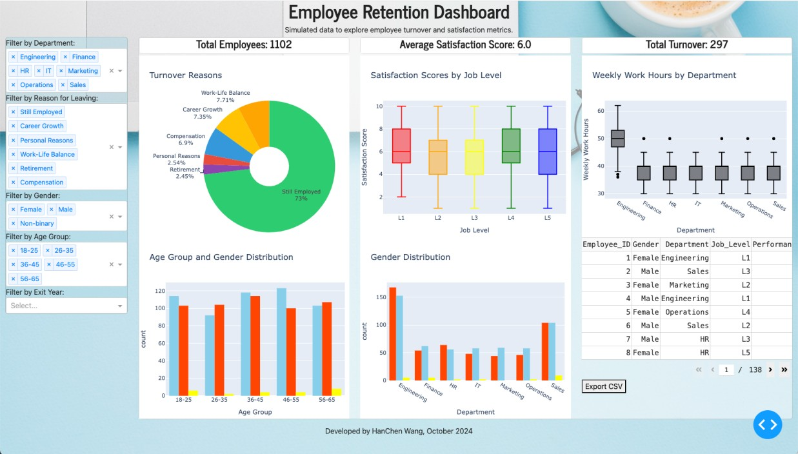

# Employee Retention Dashboard



## Author
**HanChen Wang**  
*October 2024*

## Overview
The **Employee Retention Dashboard** is an interactive web application designed to visualize and analyze employee turnover and satisfaction metrics using simulated data. The dashboard provides insights into various factors affecting employee retention, helping organizations to identify trends and areas for improvement.

## Dataset Simulation
The dataset used in this dashboard is a simulated employee dataset, comprising various attributes related to employee demographics, job roles, satisfaction scores, reasons for leaving, and employment dates. The following key attributes are included:

- **Employee ID**: Unique identifier for each employee.
- **Department**: The department in which the employee works.
- **Job Level**: The job level of the employee, categorized from L1 to L5.
- **Gender**: Gender of the employee (Male, Female, Non-binary).
- **Age Group**: Age classification of the employee.
- **Start Date**: The date the employee started working.
- **End Date**: The date the employee left the organization (if applicable).
- **Reason for Leaving**: The reason provided by the employee for leaving the organization.
- **Satisfaction Score**: A score indicating the employee's satisfaction level.
- **Work Hours**: The average weekly work hours of the employee.

This simulated data allows users to explore various scenarios and understand how different factors contribute to employee turnover and satisfaction.

## App Features
The **Employee Retention Dashboard** includes the following features:

- **Dynamic Filtering**: Users can filter data based on department, reason for leaving, gender, age group, and exit year.
- **Visualizations**: The dashboard presents several interactive graphs, including:
  - Turnover Reasons by Department (Pie Chart)
  - Satisfaction Scores by Job Level (Box Plot)
  - Weekly Work Hours by Department (Box Plot)
  - Age Group and Gender Distribution (Histogram)
  - Gender Distribution by Department (Histogram)
- **Data Preview**: A table displaying filtered employee data, allowing users to review specific entries.
- **Data Export**: Users can export the filtered dataset as a CSV file for further analysis.

## Deployment
This dashboard is deployed on [Render.com](https://employee-retention-e6x1.onrender.com/), where you can access the application and interact with the simulated employee data.

### Access the Dashboard
Click [here](https://employee-retention-e6x1.onrender.com/) to access the Employee Retention Dashboard.

## Installation
To run this app locally, follow these steps:

1. Clone the repository:
   ```bash
   git clone https://github.com/hcwang24/employee_retention.git
   ```

2. Navigate to the project directory:
   ```bash
   cd employee-retention-dashboard
   ```

3. Install the required dependencies:
   ```bash
   pip install -r requirements.txt
   ```

4. Run the app:
   ```bash
   python app.py
   ```

## Contributing
Contributions are welcome! Please feel free to open issues or submit pull requests.

## License
This project is licensed under the MIT License. See the [LICENSE](LICENSE) file for details.
